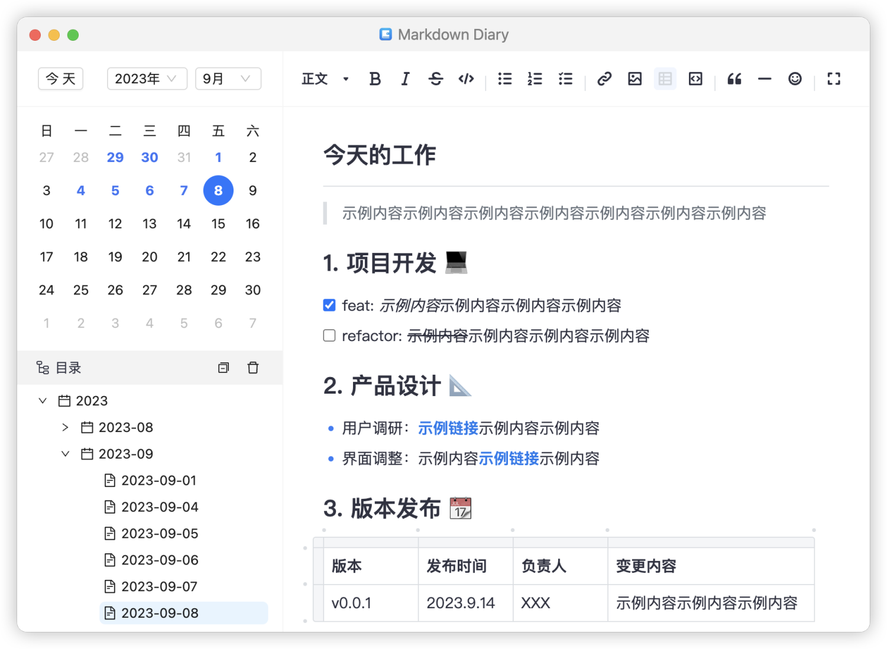

# Markdown Diary

Markdown Diary是一款设计优雅的日记软件，支持Markdown语法输入和实时预览。

## 软件特性

- 一目了然的用户界面，简单免配置、开箱即用
- 支持Markdown语法输入，内容原地实时预览
- 日记支持表格可视化编辑、本地图片插入/粘贴
- 支持输入密码登录，日记隐私内容更有保障
- 支持按目录批量操作日记（如：删除等）
- 数据纯本地保存，无惧云端第三方安全风险
- 支持Windows、Mac、Linux多个系统平台

## 下载地址

### 一键下载

- [Windows](https://gitee.com/stevobm/md-diary-release/releases/download/latest/md-diary-0.2.15-setup.exe)
- [MacOS](https://gitee.com/stevobm/md-diary-release/releases/download/latest/md-diary-0.2.15-x64-mac.dmg)
- [Linux(DEB)](https://gitee.com/stevobm/md-diary-release/releases/download/latest/md-diary_0.2.15_amd64.deb)
- [Linux(RPM)](https://gitee.com/stevobm/md-diary-release/releases/download/latest/md-diary-0.2.15.x86_64.rpm)

### 备用下载

> 包含历史各个版本以及系统架构(ARM等)

- [Gitee](https://gitee.com/stevobm/md-diary-release/releases/tag/latest)
- [Github](https://github.com/stevobm/md-diary-releases/releases/latest)
- [百度网盘](https://pan.baidu.com/s/1M1OeMXaWnTr8f0_oXtR08Q?pwd=c2rd) 提取码: c2rd
- [城通网盘](https://url43.ctfile.com/d/3173743-57977955-91e7e2?p=3701) 访问密码：3701

## 更新日志
- [Markdown Diary 更新日志](https://iwpy5b9mc7u.feishu.cn/wiki/NBUlwldFFi9A1sklIDicGE4NnSg)
